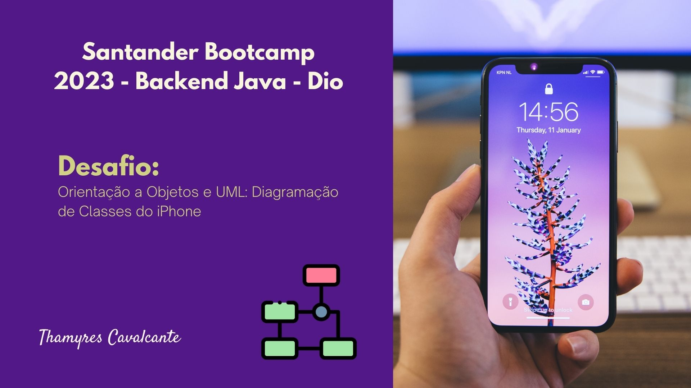
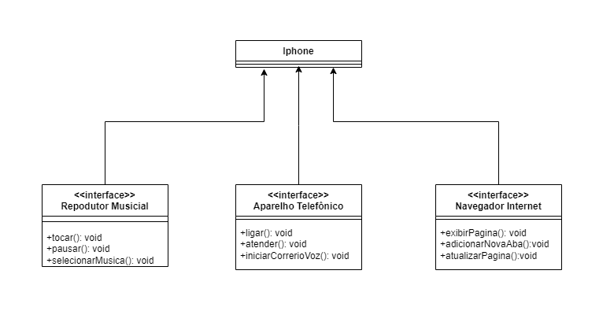

| Desafio | BOOTCAMP SANTANDER 2023 - DIO  |
| -------------  |--------------------------------|
| Nome        | **POO e modelagem UML**  
| Tecnologias | Java, POO, modelagem UML                
| URL         | https://github.com/Thamyresmya/Desafio3_Santander_Dio-Diagramacao_de_Classes

# Desafio: Orientação a Objetos e UML: Diagramação de Classes do iPhone

## 🚀 Tecnologias

Esse projeto foi desenvolvido com as seguintes tecnologias:

- Java
- POO
- Git e Github

## 🎯 Desafio

Modelagem e diagramação da representação em UML e Código no que se refere ao componente iPhone.

Com base no vídeo de lançamento do iPhone conforme link abaixo, elabore em uma ferramenta de UML de sua preferência a diagramação das classes e interfaces com a proposta de representar os papéis do iPhone de: Reprodutor Musicial, Aparelho Telefônico e Navegador na Internet. Em seguida crie as classes e interfaces no formato de arquivos .java

[Lançamento iPhone 2007](https://www.youtube.com/watch?v=9ou608QQRq8)

* Minutos relevantes do 00:15 até 00:55
  
* Comportamentos esperados:
  - Repodutor Musicial: tocar, pausar, selecionarMusica
  - Aparelho Telefônico: ligar, atender, iniciarCorrerioVoz
  - Navegador na Internet: exibirPagina, adicionarNovaAba, atualizarPagina

## ✨ UML
UML: Diagramação de Classes do iPhone

## 🔗 Me siga nas redes sociais:
- [Linkedin](https://www.linkedin.com/in/thamyrescavalcante/)
- [Instagran](https://www.instagram.com/thamyres__cavalcante/)

 

---

### Feito com 💜 by Thamyres Cavalcante